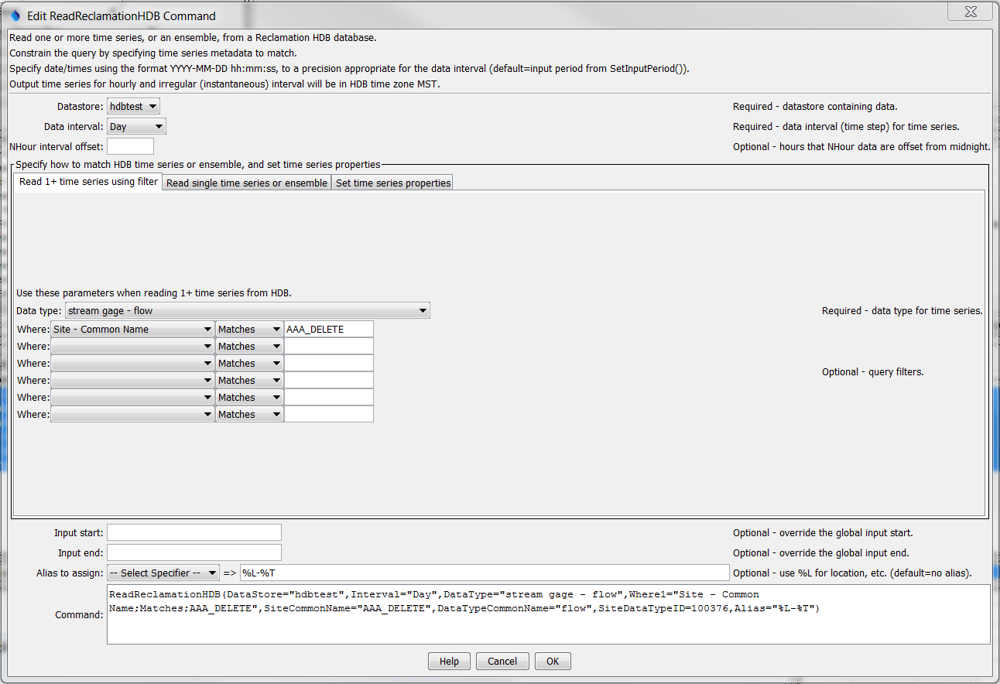
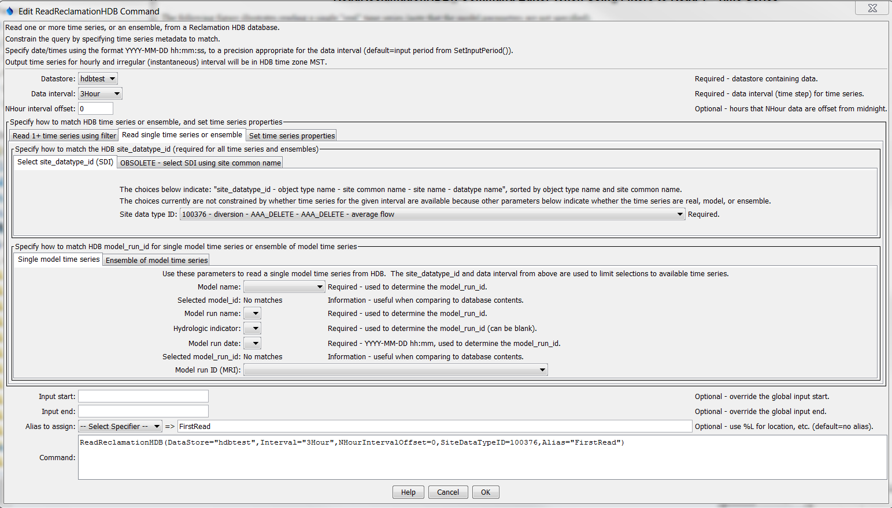
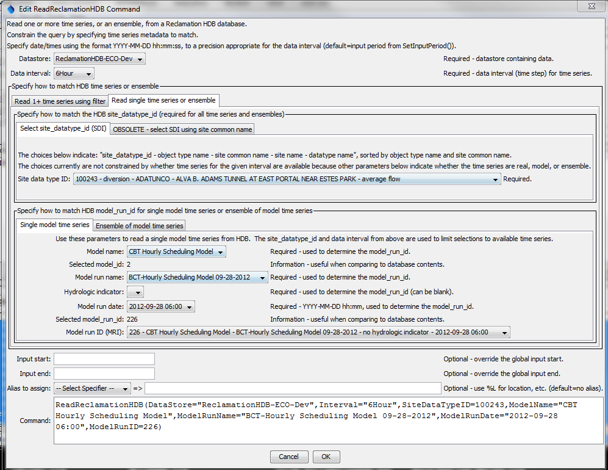
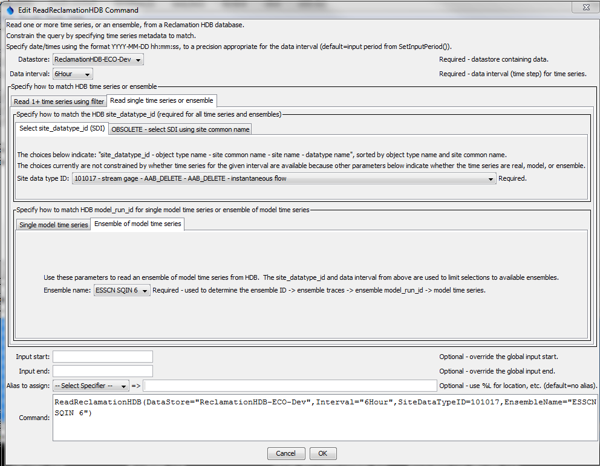
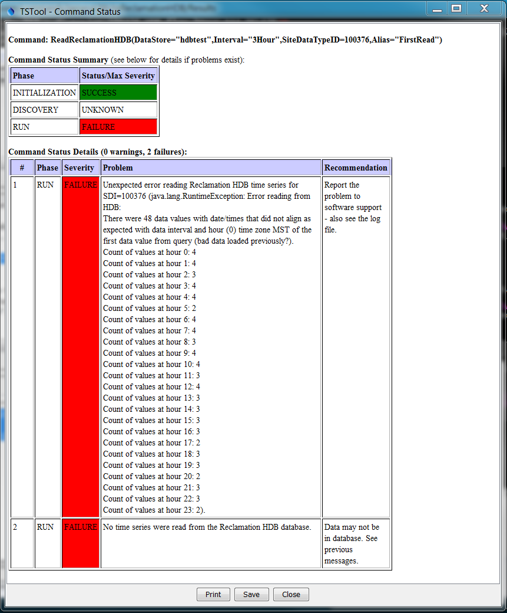
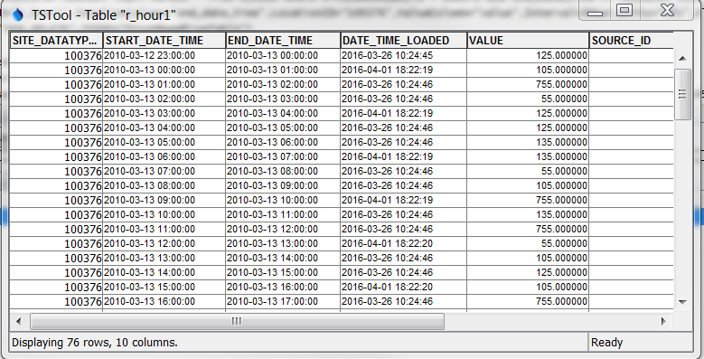

# TSTool / Command / ReadReclamationHDB #

*   [Overview](#overview)
*   [Command Editor](#command-editor)
*   [Command Syntax](#command-syntax)
*   [Examples](#examples)
*   [Troubleshooting](#troubleshooting)
*   [See Also](#see-also)

-------------------------

## Overview ##

The `ReadReclamationHDB` command reads one or more time series from a Reclamation HDB database.
See the [Reclamation HDB Datastore Reference](../../datastore-ref/ReclamationHDB/ReclamationHDB.md)
for more information about the database features and limitations.
Time series are read from:

*   a single "real" time series (observations)
*   a single "model" time series (results from a model)
*   a time series ensemble, indicated by the ensemble name, in which case each ensemble trace time series is read as a "model" time series

The primary metadata necessary to read the time series are a site data type identifier (SDI) and,
if reading a model time series, a model run identifier (MRI).
these values can be selected directly (from long lists),
or selected through incremental selection of other data.
Both options are provided for flexibility where appropriate.

See the [`WriteReclamationHDB`](../WriteReclamationHDB/WriteReclamationHDB.md) command documentation
for information about writing the time series that are read by this command.

In all cases, the choices presented to the user cascade to allow only valid choices.
For example, when a site data type identifier is selected, then only time series and
ensembles are listed that have data records with the site data type identifier.
This ensures that only time series with data are read.

Additional functionality includes:

*   When reading hour interval data, including NHour data: regardless of the requested input period,
    the time series that is read will have its start and end date/time set to actual date/time.
    This ensures that odd offsets such as hour 1 for 3Hour data will match the actual data.

## Command Editor ##

The command is available in the following TSTool menu:

*   ***Commands / Read Time Series***

The following dialog is used to edit the command and illustrates the syntax of the command
when reading "real" or "model" data using filters.
This approach can be used when reading one or more time series in bulk.
***Where*** criteria should be specified in sequential order without intervening blank specifiers.

**<p style="text-align: center;">

</p>**

**<p style="text-align: center;">
`ReadReclamationHDB` Command Editor when Using Filters to Read 1+ Time Series (<a href="../ReadReclamationHDB.png">see full-size image</a>)
</p>**

The following figure illustrates reading a single "real" time series (note that the model parameters are not specified).

**<p style="text-align: center;">

</p>**

**<p style="text-align: center;">
`ReadReclamationHDB` Command Editor to Read a Single Real Time Series (<a href="../ReadReclamationHDB_Real.png">see full-size image</a>)
</p>**

The following figure illustrates reading a single "model" time series,
in which case the model parameters are specified in addition
to the site and data type parameters. There are two ways to select the MRI:

1.  Pick the MRI from the list at the bottom of the parameter section:
    1.  Additional information is shown in the choice, but only the MRI is saved in the command parameter
2.  Sequentially pick model-related metadata until a unique MRI is determined (multiple command parameters are saved):
    1.  Model name
    2.  Model run name
    3.  Hydrologic indicator (may be blank)
    4.  Run date (may be blank)

The following figure illustrates both approaches, although normally one or the other would be used. Selecting an MRI directly takes precedence over the other approach.

**<p style="text-align: center;">

</p>**

**<p style="text-align: center;">
`ReadReclamationHDB` Command Editor for Single Model Time Series (<a href="../ReadReclamationHDB_Model.png">see full-size image</a>)
</p>**

The following figure illustrates reading an ensemble of "model" time series,
in which case an ensemble name is specified in addition to the SDI. Ensembles are stored in HDB as follows:

*   Ensemble (ensemble name is unique)
    +   Trace(s) (trace number is unique)
        -   Model run identifier(s) (MRI is unique)
            *   `M_*` data tables

Consequently, in order to list the ensemble names for selection,
the data table is checked for matching SDI, and additional queries map the data back to the ensemble data,
which provide the list of ensemble names to choose from.

**<p style="text-align: center;">

</p>**

**<p style="text-align: center;">
`ReadReclamationHDB` Command Editor to Read an Ensemble of Model Time Series (<a href="../ReadReclamationHDB_Ensemble.png">see full-size image</a>)
</p>**

## Command Syntax ##

The command syntax is as follows:

```text
ReadReclamationHDB(Parameter="Value",...)
```
**<p style="text-align: center;">
Command Parameters
</p>**

|**Parameter**&nbsp;&nbsp;&nbsp;&nbsp;&nbsp;&nbsp;&nbsp;&nbsp;&nbsp;&nbsp;&nbsp;&nbsp;&nbsp;&nbsp;&nbsp;&nbsp;&nbsp;&nbsp;&nbsp;&nbsp;&nbsp;&nbsp;&nbsp;|**Description**|**Default**&nbsp;&nbsp;&nbsp;&nbsp;&nbsp;&nbsp;&nbsp;&nbsp;&nbsp;&nbsp;&nbsp;&nbsp;&nbsp;&nbsp;&nbsp;&nbsp;&nbsp;&nbsp;&nbsp;&nbsp;&nbsp;&nbsp;&nbsp;&nbsp;&nbsp;&nbsp;&nbsp;|
|--------------|-----------------|-----------------|
|`DataStore`<br>**required**|Reclamation HDB data store name indicating database from which to read time series.|None - must be specified.|
|`Interval`<br>**required**|The data interval to read (`Hour`, `Day`, `Month`, `Year`, `Irregular`). `Irregular` is used for instantaneous data and internally results in data with date/times to minute precision.|None - must be specified.|
|`NHourIntervalOffset`|There are cases where data may have been loaded into HDB on hours that do not properly align with expected hour offset for NHour data. For example, data in HDB for the ECAO office are saved in MST time zone but data may have been saved with a 1-hour daylight savings offset. 3Hour interval model data may be loaded on odd offsets, for example hour 1, 4, 7, 10, 13, 16, 19, and 22. In this case if extra data were loaded at other hours, TSTool does not know what data are valid and will generate an error. The offending data can be removed using a database tool, or the `NHourIntervalOffset` parameter can be specified to tell TSTool what data to use (in this case the offset would be 1).|Data are used as is. Checks verify that all data align as expected with NHour interval and if not an error is generated.|
||**Use the following parameter when reading 1+ time series using filters.**||
|`DataType`<br>**required**|The data type to read as `ObjectType - DataTypeCommonName`. The object type is shown to help with selections. `*` can be specified to read all data types.|None - must be specified.|
|`WhereN`|The "where" clauses to be applied when querying data, which match the values in the ***Where*** fields in the TSTool main interface. The parameters should be specified as `Where1`, `Where2`, etc., with no intervening gaps in numbering. All clauses are joined as "and" and are therefore cumulative in limiting the query. The format of each parameter value is:<br>`"Item;Operator;Value"`<br>Where `Item` indicates a data field to be filtered on, `Operator` is the type of constraint, and `Value` is the value to be checked when querying.|If not specified, the query will not be limited and very large numbers of time series may result from the query (which may require a long time to perform the query).|
||**Use the following parameters when reading a single time series or an ensemble of time series.**||
|`SiteDataTypeID`<br>**required**|The `site_datatype_id` value to match the time series. Direct selection using the provided choices is preferred because the other parameters (below) are not guaranteed to be unique.||
|`SiteCommonName`<br>**required**|The site common name for the time series location; used with the data type common name to determine the `site_datatype_id` in the database. This approach is discouraged and may be removed in the future because `site_common_name` is not unique in HDB.|None - must be specified unless `SiteDataTypeID` is specified.|
|`DataTypeCommonName`<br>**required**|The data type common name for the time series; used with the site common name to determine the `site_datatype_id` in the database. This approach is discouraged and may be removed in the future because `datatype_common_name` is not unique in HDB.|None - must be specified unless `SiteDataTypeID` is specified.|
||**Use the following parameters when reading a single model time series.**||
|`ModelRunID`|The `model_run_id` value to match the time series. Direct selection using the provided choices is an option to specifying the equivalent multiple parameters described below.||
|`ModelName`|The model name for the time series; used with the model run name, hydrologic indicator(s), and model run date to determine the `model_run_id` in the database.|None - must be specified unless `ModelRunID` is specified.|
|`ModelRunName`|The model run name for the time series; used with the model name, hydrologic indicator(s), and model run date to determine the `model_run_id` in the database.|None - must be specified unless `ModelRunID` is specified.|
|`ModelRunDate`|The model run date (timestamp) to use for the time series; used with the model name, model run name, and hydrologic indicator(s) to determine the` model_run_id` in the database. The run date should be specified using the format `YYYY-MM-DD hh:mm` (zero-padded with hour `0`-`23`, minute `0`-`59`).|None - must be specified unless `ModelRunID` is specified.|
|`HydrologicIndicator`|The hydrologic indicator(s) to use for the time series; used with the model name, model run name, and model run date to determine the `model_run_id` in the database.|None - must be specified unless `ModelRunID` is specified.|
||**Use the following parameters when reading an ensemble of model time series.**||
|`EnsembleName`|The name of the ensemble to read. Corresponding trace data are queried to determine `model_run_id` to read individual time series.|Must be specified if reading an ensemble.|
|`OutputEnsembleID`|The Ensemble ID to assign to output, which can be used with other TSTool commands.|Ensemble ID is set to the `EnsembleName`|
||**The following parameters are always appropriate.**|
|`Properties`|String properties to be assigned to the time series using syntax: `Property1:Value1,Property2:Value2`||
|`InputStart`|Start of the period to query, specified in format `YYYY-MM-DD hh:mm`, with a precision appropriate for the interval. If not aligned with the time series data records for NHour data, the input start hour will be adjusted to the first interval in the day that aligns with the time series data.|Read all available data.|
|`InputEnd`|End of the period to query, specified in format `YYYY-MM-DD hh:mm`, with a precision appropriate for the interval. If not aligned with the time series data records for NHour data, the input start hour will be adjusted to the last interval in the day that aligns with the time series data.|Read all available data.|
|`Alias`|Indicate an alias to assign to time series, which can result in shorter identifiers for time series when referenced with other commands.|No alias is assigned.|

## Examples ##

See the [automated tests](https://github.com/OpenWaterFoundation/owf-tstool-reclamationhdb-plugin/tree/master/test/commands/ReadReclamationHDB).

## Troubleshooting ##

See the main [TSTool Troubleshooting](../../troubleshooting/troubleshooting.md) documentation.

### Data Alignment Error for NHour Time Series ###

The error shown in the following figure may be generated if data were previously
loaded such that the timestamp does not align with NHour interval.
This may be due to using a version of TSTool older than 11.10.00
(which did properly handle daylight savings time for hourly and instantaneous data)
or because multiple time series intervals are written for the same SDI.
For example, automated tests re-use the same SDI to read and write data
for different time series intervals. The solution is to do one of the following.

*   Delete the bad data records in HDB. For example, use the
    [`RunSql`](https://opencdss.state.co.us/tstool/latest/doc-user/command-ref/RunSql/RunSql/RunSql/)
    command with an SQL file similar to the following (however, this does not seem to work.):

```
/* SQL to delete all records in period of test so old data does not interfere with test */
begin
DELETE_R_BASE(100376,'hour',to_date('2010-03-12 00','YYYY-MM-DD HH24'),to_date('2010-03-17 00','YYYY-MM-DD HH24'),7,NULL);
end;
```

*   Specify the `NHourIntervalOffset` command parameter as the expected hour offset from midnight
    for the first data value in the hourly time series,
    for the HDB time zone (e.g., MST for ECAO database).
    This tells TSTool to ignore all records that do not align.

**<p style="text-align: center;">

</p>**

**<p style="text-align: center;">
Error Generated When Database Records do not Align with NHOur Interval (<a href="../ReadReclamationHDB_AlignmentError.png">see full-size image</a>)
</p>**

The database records are shown below.

**<p style="text-align: center;">

</p>**

**<p style="text-align: center;">
HDB `R_HOUR` Table Illustrating Extra Data Records (should have every 3 hour but have every 1 hour) (<a href="../ReadReclamationHDB_AlignmentErrorData.png">see full-size image</a>)
</p>**

## See Also ##

*   [`RunSql`](https://opencdss.state.co.us/tstool/latest/doc-user/command-ref/RunSql/RunSql/) command
*   [`WriteReclamationHDB`](../WriteReclamationHDB/WriteReclamationHDB.md) command
