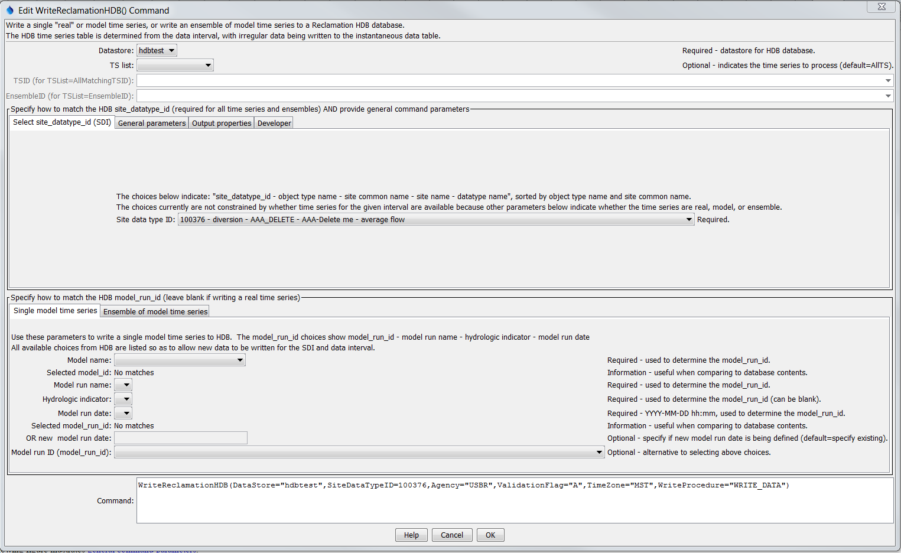
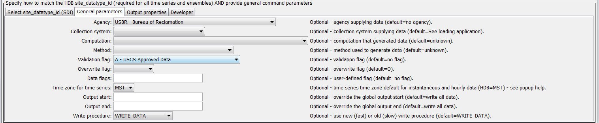
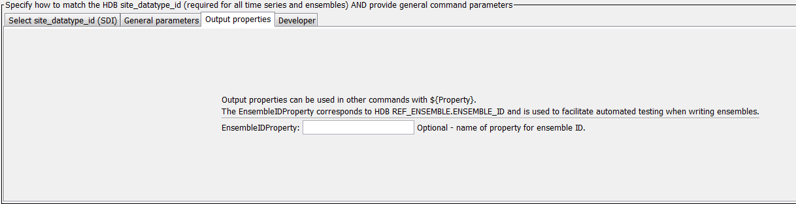
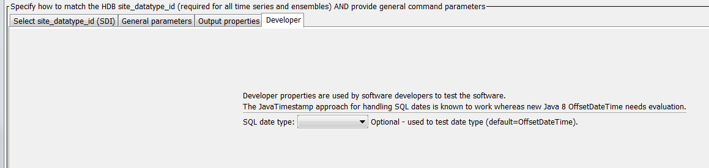
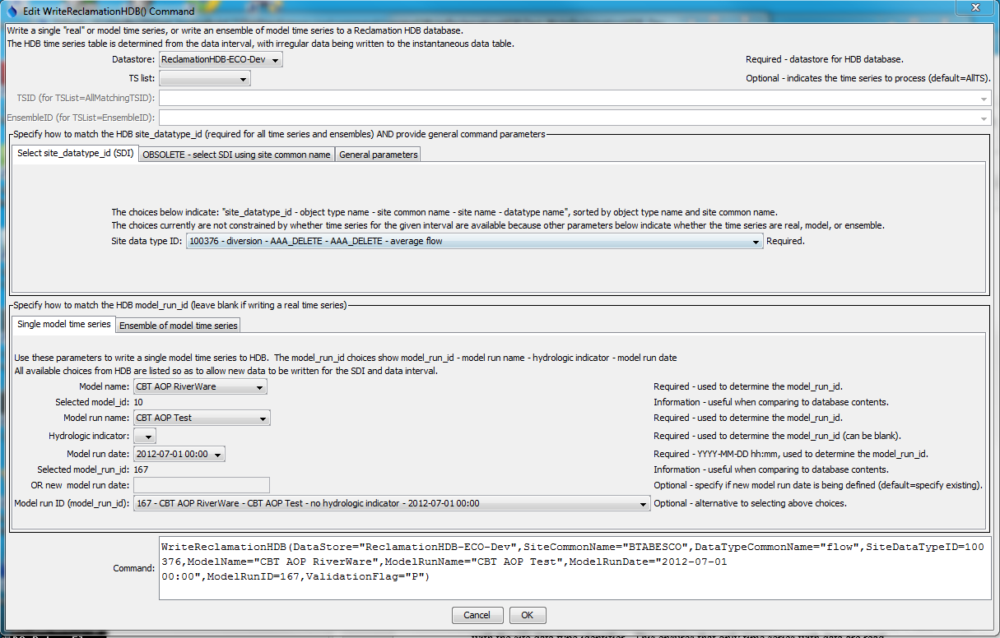
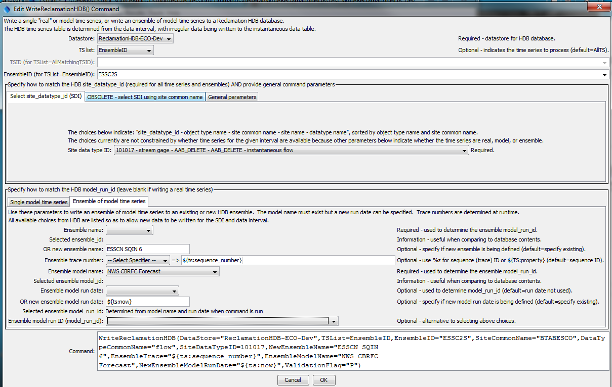

# TSTool / Command / WriteReclamationHDB #

*   [Overview](#overview)
*   [Command Editor](#command-editor)
    +   [Command Editor for Single Real Time Series](#command-editor-for-single-real-time-series)
    +   [Command Editor for General Parameters and Output Properties](#command-editor-for-general-parameters-and-output-properties)
*   [Command Syntax](#command-syntax)
*   [Examples](#examples)
*   [Troubleshooting](#troubleshooting)
*   [See Also](#see-also)

-------------------------

## Overview ##

The `WriteReclamationHDB`() command writes time series to a Reclamation HDB database.
See the [Reclamation HDB Datastore Reference](../../datastore-ref/ReclamationHDB/ReclamationHDB.md)
for more information about the database features and limitations.
See the [`ReadReclamationHDB`](../ReadReclamationHDB/ReadReclamationHDB.md) command documentation
for information about reading the time series that are written by this command.
The following time series can be written:

*   a single "real" time series (observations)
*   a single "model" time series (results from a model)
*   a time series ensemble, indicated by the ensemble name, in which case each ensemble trace time series is read as a "model" time series

Command functionality includes:

*   **Time series metadata/new time series**:
    +   In general, the command will not define new sites, data types, site datatype identifier (SDI) combinations,
        models or other fundamental data. It is expected that such data have previously been defined in the database.
    +   New real time series can be written by selecting the appropriate SDI.
        New (non-ensemble) model time series can be specified by selecting a model run information
        and if appropriate a new run date. New ensembles and corresponding trace time series
        can be defined by specifying ensemble name, trace number, and model run date using the
        `NewEnsembleName` and `NewEnsembleModelRunDate` command parameters.
*   **Date/time handling**:
    +   TSTool uniformly uses the time at the end of the recorded interval for data values
        (instantaneous time or end of interval for mean and accumulated values),
        whereas HDB uses the time at the beginning of the recorded interval for hourly data.
        See the [Reclamation HDB Datastore Reference](../../datastore-ref/ReclamationHDB/ReclamationHDB.md) for more information.
    +   Writing NHour data uses `WRITE_TO_HDB` procedure where the `SAMPLE_END_DATETIME`
        is set to the TSTool date/time and `SAMPLE_DATE_TIME` is set the TSTool date/time minus NHour.
        Currently the procedure always stores the difference as one hour but this is being evaluated.
*   **Updating time series records**:
    +   Time series data records for an existing time series will be updated if previously written.
        The values in the write period are not removed before writing.
        **It would be useful to have the ability to write null or a missing value in the database or delete values before writing**.
*   **Missing data**:
    +   Missing data currently are not written. By convention missing values in HDB are simply not included in the database.
        Currently the command will not delete previous records if the new value at a date/time is missing.
        **It would be useful to have the ability to clear the time series
        values in the write period before inserting the new values. This would ensure that the data are current.**
*   **Data units**:
    +   Data units in the time series are not checked against data units in the database
        because the units in TSTool data may originally have come from various
        sources that do not use the same units abbreviations as HDB.
        It is the user's responsibility to ensure that time series that are
        being written have units that are compatible with HDB.
* **Data flags**:
    +   Data flags from the time series are not written to the database.
        The `ValidationFlag`, `OverwriteFlag`, and `DataFlags` parameters are provided to specify HDB flags.
        Additional capability may be added in the future.
*   **Time zone**:
    +   Time zone can be indicated in TSTool time series by including in the
        start and end date/time information; however,
        time zones can be difficult to standardize when data comes from different sources.
        The default time zone for HDB is configured for the Reclamation office that uses the database.
        To ensure proper data loading, the TimeZone command parameter,
        which indicates the time zone for the time series data, is required as of TSTool 11.09.02
        (it was optional prior to this version). If the time zone for the data are different from the database,
        the HDB `WRITE_TO_HDB` stored procedure will adjust the data in the
        database to store as the database time zone.
        It is the user's responsibility to verify that the correct time zone is being provided
        to the `WriteReclamationHDB` command.
        **It is strongly recommended that standard time be used for time series data and if
        possible use the same time zone as the database.
        A daylight savings time zone such as MDT or PDT could be used for a time series period
        that is entirely in that zone; however,
        switching between standard and daylight savings time in time series leads to confusion.**
*   **HDB data table**:
    +   The time series interval is used to determine the HDB time series table to write,
        with irregular data being written as instantaneous data with date/time precision to minute.
    +   TSTool treats year-interval data generically and does not manage water year
        (or other types of years) in special fashion,
        other than when processing data into year interval time series.
        Water year data can be saved in year interval data but currently
        there is no way to write to the water-year tables in HDB.
*   **HDB database procedure**:
    +   The write procedure is controlled by the `WriteProcedure` command parameter.
        If `WriteProcedure=WRITE_DATA`, then the new HDB `TS_XFER.WRITE_REAL_DATA` and `TS_XFER.WRITE_MODEL_DATA`
        stored procedures are used to write the data.
        These procedures take arrays for the date/times and values, and consequently are faster.
        If `WriteProcedure=OLD_WRITE_TO_HDB`, then the legacy HDB `WRITE_TO_HDB` stored procedure
        is used to write individual time series data records.This has the disadvantage of higher overhead. For the legacy and new procedures:
        -   The time series is written to a model time series table if model parameters are specified.
        -   The model run date, for single time series and ensembles,
            is truncated to minutes in time series identifiers and for query purposes.
            In general, however, current software functionality uses the site datatype identifier (SDI)
            and model run identifier (MRI) rather than the text versions of identifiers.
    +   When writing ensembles, the HDB procedure `ENSEMBLE.GET_TSTOOL_ENSEMBLE_MRI` is
        used to determine the model run identifier corresponding to model time series
        and then the data-writing procedures (above) are used to write data records:
        -   The ensemble name is determined from the `EnsembleName` parameter
            (or `NewEsembleName` parameter if creating a new ensemble).
            Existing names can be selected or a new name can be specified.
        -   The trace number is determined from the `EnsembleTrace` command parameter,
            and will result in the trace being taken from specific time series properties.
            Currently this must be an integer but in the future string trace
            identifiers may be supported (TSTool uses string identifiers internally).
        -   The model name is determined from the `EnsembleModelName` parameter.
            Model names consistent with non-ensemble model time series are used.
        -   The model run date is determined from the `EnsembleModelRunDate` parameter
            (or `NewEnsembleModelRunDate` parameter if writing data for a new run date).
            If specified then the `P_IS_RUNDATE_KEY` procedure parameter is set to `Y`,
            if not specified it is set to `N`).
            Consequently, ensemble time series can be written with or without a model run date.

## Command Editor ##

The command is available in the following TSTool menu:

*   ***Commands / Output Time Series***

### Command Editor for Single Real Time Series ###

The following dialog is used to edit the command and illustrates the syntax of the command when
writing "real" data, in which case model information in the lower panel are not specified.
Time series or ensemble to write are specified with shared parameters.
Currently the `site_name` and `site_common_name` are not required to be unique in HDB and
therefore specifying the unique `site_datatype_id` (SDI) is the only way to ensure that the proper time series is being selected.

**<p style="text-align: center;">

</p>**

**<p style="text-align: center;">
`WriteReclamationHDB` Command Editor for "Real" Time Series (<a href="../WriteReclamationHDB.png">see full-size image</a>)
</p>**

### Command Editor for General Parameters and Output Properties ###

The following figure illustrates general command parameters.

**<p style="text-align: center;">

</p>**

**<p style="text-align: center;">
`WriteReclamationHDB` Command Editor for General Parameters (<a href="../WriteReclamationHDB_General.png">see full-size image</a>)
</p>**

The following figure illustrates output property parameters.

**<p style="text-align: center;">

</p>**

**<p style="text-align: center;">
`WriteReclamationHDB` Command Editor for Output Property Parameters (<a href="../WriteReclamationHDB_OutputProperties.png">see full-size image</a>)
</p>**

The following figure illustrates developer property parameters.

**<p style="text-align: center;">

</p>**

**<p style="text-align: center;">
`WriteReclamationHDB` Command Editor for Developer Property Parameters (<a href="../WriteReclamationHDB_Developer.png">see full-size image</a>)
</p>**

### Command Editor for Single Model Time Series ###

The following figure illustrates the syntax of the command when writing "model"
data for a single time series, in which case the model parameters are
specified via the Single model time series tab.
The model run identifier can be specified in one of two ways.

1.  Select the MRI from the list at the bottom of the dialog
2.  Select the MRI by specifying multiple values that result in a unique MRI:
    1.  Model name
    2.  Model run name
    3.  Hydrologic indicator (can be blank)
    4.  Run date (can be blank) - currently a new run date cannot be specified
    The example in the following shows parameter values for both methods for illustration;
    however, the directly selected `ModelRunID` will be used in this case.

**<p style="text-align: center;">

</p>**

**<p style="text-align: center;">
`WriteReclamationHDB` Command Editor for Single Model Time Series (<a href="../WriteReclamationHDB_Model.png">see full-size image</a>)
</p>**

### Command Editor for Ensemble of Model Time Series ###

The following figure illustrates the syntax of the command when writing an
ensemble of model time series, in which case ensemble and related model parameters are
specified via the ***Ensemble of model time series*** tab.
The TSTool ensemble to write is specified with the `TSList=EnsembleID` and `EnsembleID` parameters.
In the following example a new ensemble is being written.
The time series trace number and model run date are both taken from the ensemble time series properties when the command is run.

**<p style="text-align: center;">

</p>**

**<p style="text-align: center;">
`WriteReclamationHDB` Command Editor for Ensemble of Model Time Series (<a href="../WriteReclamationHDB_Ensemble.png">see full-size image</a>)
</p>**

## Command Syntax ##

The command syntax is as follows:

```text
WriteReclamationHDB(Parameter="Value",...)
```
**<p style="text-align: center;">
Command Parameters
</p>**

|**Parameter**&nbsp;&nbsp;&nbsp;&nbsp;&nbsp;&nbsp;&nbsp;&nbsp;&nbsp;&nbsp;&nbsp;&nbsp;&nbsp;&nbsp;&nbsp;&nbsp;&nbsp;&nbsp;&nbsp;&nbsp;&nbsp;&nbsp;&nbsp;&nbsp;&nbsp;&nbsp;&nbsp;&nbsp;&nbsp;&nbsp;&nbsp;|**Description**|**Default**&nbsp;&nbsp;&nbsp;&nbsp;&nbsp;&nbsp;&nbsp;&nbsp;&nbsp;&nbsp;&nbsp;&nbsp;&nbsp;&nbsp;&nbsp;&nbsp;&nbsp;&nbsp;&nbsp;&nbsp;&nbsp;&nbsp;&nbsp;&nbsp;&nbsp;&nbsp;&nbsp;|
|--------------|-----------------|-----------------|
|`DataStore`<br>**required**|The identifier for the ReclamationHDB data store to use for the database.|None - must be specified.|
|`TSList`|Indicates the list of time series to be processed, one of:<br><ul><li>`AllMatchingTSID` – all time series that match the TSID (single TSID or TSID with wildcards) will be processed.</li><li>`AllTS` – all time series before the command.</li><li>`EnsembleID` – all time series in the ensemble will be processed (see the EnsembleID parameter).</li><li>`FirstMatchingTSID` – the first time series that matches the TSID (single TSID or TSID with wildcards) will be processed.</li><li>`LastMatchingTSID` – the last time series that matches the TSID (single TSID or TSID with wildcards) will be processed.</li><li>`SelectedTS` – the time series are those selected with the [`SelectTimeSeries`](https://opencdss.state.co.us/tstool/latest/doc-user/command-ref/SelectTimeSeries/SelectTimeSeries/) command.</li></ul> | `AllTS` |
|`TSID`|The time series identifier or alias for the time series to be processed, using the `*` wildcard character to match multiple time series.  Can be specified using `${Property}`.|Required if `TSList=*TSID`|
|`EnsembleID`|The ensemble to be processed, if processing an ensemble. Can be specified using `${Property}`.|Required if `TSList=*EnsembleID`|
|`SiteDataTypeID`|The `site_datatype_id` value to match the time series. If specified, the value will be used instead of the `site_datatype_id` determined from `SiteCommonName` and `DataTypeCommonName`.||
|`SiteCommonName`|The site common name for the time series location; used with the data type common name to determine the `site_datatype_id` in the database. Because `SiteCommonName` is not guaranteed to be unique, the `SiteDataTypeID` should be specified instead.|None - must be specified unless `SiteDataTypeID` is specified.|
|`DataTypeCommonName`|The data type common name for the time series; used with the site common name to determine the `site_datatype_id` in the database. Because `DataTypeCommonName` is not guaranteed to be unique without additional information such as HDB object type, the `SiteDataTypeID` should be specified instead.|None - must be specified unless `SiteDataTypeID` is specified.|
||**Use the following parameters when writing a single model time series.**||
|`ModelName`|The model name for the time series; used with the model run name, hydrologic indicator(s), and model run date to determine the `model_run_id` in the database.|None - must be specified unless `ModelRunID` is specified.|
|`ModelRunName`|The model run name for the time series; used with the model name, hydrologic indicator(s), and model run date to determine the `model_run_id` in the database.|None - must be specified unless `ModelRunID` is specified.|
|`HydrologicIndicator`|The hydrologic indicator(s) to use for the time series; used with the model name, model run name, and model run date to determine the `model_run_id` in the database. The hydrologic indicate can be blank.|None - must be specified unless `ModelRunID` is specified.|
|`ModelRunDate`|The model run date (timestamp) to use for the time series; used with the model name, model run name, and hydrologic indicator(s) to determine the `model_run_id` in the database. The run date should be specified using the format YYYY-MM-DD hh:mm (zero-padded with hour 0-23, minute 0-59). Run dates in HDB include seconds, but this information is ignored when matching time series.|None - must be specified unless `ModelRunID` is specified.|
|`NewModelRunDate`|If specified, the new model run date will be used instead of the `ModelRunDate`. This parameter is currently not implemented.|Use `ModelRunDate`.|
|`ModelRunID`|The `model_run_id` value to match the time series. If specified, the value will be used instead of the `model_run_id` determined from `ModelName`, `ModelRunName`, `HydrologicIndicator`, and `ModelRunDate` (or `NewModelRunDate`).||
||**Use the following parameters when writing an ensemble of model time series.**||
|`EnsembleName`|The name of the ensemble to write. The `TSList=EnsembleID` and `EnsembleID` parameters also should be specified.|Must be specified if writing an ensemble.|
|`NewEnsembleName`|If specified, the new ensemble name will be used instead of the `EnsembleName`. See `EnsembleTrace` notes below for options to format the new ensemble name.|`EnsembleName`|
|`EnsembleModelName`|The model name corresponding to the ensemble.|Must be specified if writing an ensemble.|
|`EnsembleTrace`|Indicate how to identify time series trace identifiers:<br><ul><li>`%z` - use standard time series properties to format the ensemble trace ID (see command editor for format characters). %z indicates the sequence identifier from an ensemble trace time series.</li><li>`${TS:property}` - format the trace identifier from time series properties (e.g., properties read from original ensemble data)</li><li>`${property}` - format the trace identifier from time series processor (global) properties (e.g., properties set with the SetProperty() command)</li></ul><br>The HDB `GET_TSTOOL_ENSEMBLE_MRI` procedure currently requires the identifier to be an integer. Additional options for identifying traces may be added in the future.|The time series sequence number (equivalent to the `%z` formatting string)|
|`EnsembleModelRunDate`|When writing an ensemble, an existing model run date for the ensemble, specified using format:<br><ul><li>`YYYY-MM-DD hh:mm` (zero-padded with hour 0-23)</li></ul><br>The model time series associated with the existing run will be overwritten.||
|`NewEnsembleModelRunDate`|When writing an ensemble, the new model run date for the ensemble, specified using format:<br><ul><li>`YYYY-MM-DD hh:mm` (zero-padded with hour 0-23)</li><li>`${ts:property}` - use a run date from a time series property, truncated to minute</li><li>`${property}` - format the new model run date identifier from time series processor (global) properties (e.g., properties set with the SetProperty() command)</li></ul>|If not specified, the ensemble identifier in HDB will not include the model run date.|
||**The following general parameters are always appropriate.**||
|`Agency`|The agency abbreviation (e.g., `USBR`) or agency name for data records written to the database. The user interface will show question marks if abbreviation is not known.|No agency is indicated in database.|
|`CollectionSystem`|The collection system name.|See loading application|
|`Computation`|The computation name.|unknown|
|`Method`|The method used to generate data.|unknown|
|`ValidationFlag`|HDB validation flag. Only uppercase characters are supported.|No flag is used.|
|`OverwriteFlag`|HDB overwrite flag.|Overwrite (enforced by HDB stored procedure).||
|`DataFlags`|User-defined flags, up to 20 characters.|No flags are used.|
|`TimeZone`|Three-letter time zone abbreviation for the time series data records written to the database, used if the time series does not supply a time zone. The time zone should be consistent with HDB time zones. Specifying helps ensure that the timestamp on time series data is properly handled. It is recommended that time series data use a standard time zone and not daylight savings time.|None - must be specified.|
|`OutputStart`|The date/time for the start of the output. If not aligned with the time series data records for NHour data, the output start hour will be adjusted to the first interval in the day that aligns with the time series data.|Use the global output period.|
|`OutputEnd`|The date/time for the end of the output. If not aligned with the time series data records for NHour data, the output end hour will be adjusted to the last interval in the day that aligns with the time series data.|Use the global output period.|
|`WriteProcedure`|Indicates which stored procedure should be used to write data to HDB. `OLD_WRITE_TO_HDB will` use the old write procedure, which is slow. `WRITE_DATA` uses the `TS_XFER` package.||
||**The following output property parameters are useful for controlling workflow.**||
|`EnsembleIDProperty`|The value of `HDB_REF_ENSEMBLE.ENSEMBLE_ID` will be assigned to the property. This is useful for automated tests to allow direct database queries to verify that the ensemble was written.|No property value is assigned.|

## Examples ##

See the [automated tests](https://github.com/OpenWaterFoundation/owf-tstool-reclamationhdb-plugin/tree/master/test/commands/WriteReclamationHDB).

## Troubleshooting ##

See the main [TSTool Troubleshooting](../../troubleshooting/troubleshooting.md) documentation.

## See Also ##

*   [`ReadReclamationHDB`](../ReadReclamationHDB/ReadReclamationHDB.md) command
*   [`SelectTimeSeries`](https://opencdss.state.co.us/tstool/latest/doc-user/command-ref/SelectTimeSeries/SelectTimeSeries/) command
