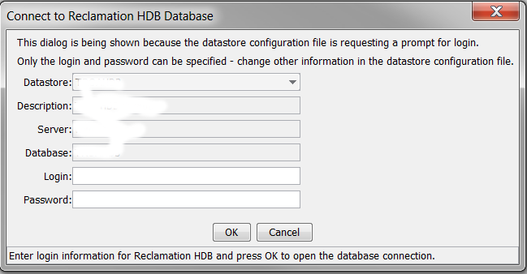
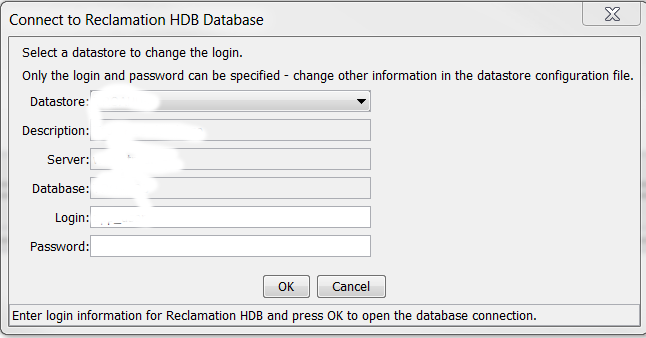

# TSTool / Datastore Reference / ReclamationHDB #

*   [Overview](#overview)
*   [Standard Time Series Properties](#standard-time-series-properties)
*   [Limitations](#limitations)
*   [Datastore Configuration File](#datastore-configuration-file)
*   [Technical Note - Handling Time Zone](#technical-note-handling-time-zone)
*   [Writing to HDB](#writing-to-hdb)
*   [Reading from HDB](#reading-from-hdb)
*   [Examples](#examples)
    +   [Writing State of Colorado Streamflow Station Time Series to HDB](#writing-state-of-colorado-streamflow-station-time-series-to-hdb)

------------

## Overview ##

The ReclamationHDB datastore corresponds to the US Bureau of Reclamation’s HDB database (version 2),
which stores real-time and historical data related to Reclamation operations.
Time series in HDB are organized into “real” tables (observations) and
“model” tables (from simulations or other external processes).
 
## Standard Time Series Properties ##

The standard time series identifier for ReclamationHDB time series is of the form:

```
LocationType:LocationID.DataSource.DataType.Interval.Scenario~DataStoreName
```

More specifically, the identifier follows the following convention for “real” data:

```
ObjectTypeName:SiteDataTypeID.HDB.DataTypeCommonName.Interval.SiteCommonName~DataStoreName
```

and the following for “model” data:

```
ObjectTypeName:SiteDataTypeID.HDB.DataTypeCommonName.Interval.SiteCommonName-ModelName-ModelRunName-HydrologicIndicator-ModelRunDate~DataStoreName
```

Because only the site data type identifier (SDI) and model run identifier (MRI) are guaranteed to be unique,
they are used as the primary data in the TSID.
Other information is used by convention to improve usability for users, but is not required.

Prior to TSTool 10.24.00 time series identifiers followed the convention shown below.
This convention is still handled as much as possible; however, because `SiteCommonName`
is not guaranteed to be unique and because model identifier parts contain periods,
dashes, and other characters, such identifiers could not be guaranteed to uniquely and reliably identify time series.

```
Location.DataSource.DataType.Interval.Scenario~DataStoreName
```

More specifically, the identifier for “real” data prior to TSTool 10.24.00 follows the convention:

```
Real:SiteCommonName.HDB.DataTypeCommonName.Interval~DataStoreName
```

and the following for “model” data prior to TSTool 10.24.00:

```
Model:SiteCommonName.HDB.DataTypeCommonName.Interval.ModelName-ModelRunName-HydrologicIndicator-ModelRunDate~DataStoreName
```

Time series identifier parts and other time series metadata are described below:

*   The TSID location type is set to the object type name, for example `diversion` or `reservoir`.
*   The TSID location identifier is set to the site data type identifier (SDI)
    for real time series and is additionally appended with the model run identifier (MRI) for model time series.
    These integer identifiers are guaranteed to be unique and not change over time.
    Although these values are enough to allow time series to be uniquely identified in the database,
    additional metadata are by convention provided in the data type and scenario TSID parts, as described below.
*   The TSID data source is set to HDB in all cases.
    The HDB design does include agency in several tables,
    but the information is not integrated enough to be used as part of the TSID:
    +   The `HDB_AGEN` table lists agencies that are known in the database.
        `AGEN_NAME` is populated; however, `AGEN_ABBREV` often is null and cannot be relied upon for use in time series identifiers.
    +   The `HDB_DATATYPE` table includes `AGEN_ID`, which relates to the `HDB_AGEN` table.
        However, many values are null and the relationship is not enforced.
    +   The `R_BASE.AGEN_ID` value indicates the agency for which values are measured.
        The general guideline for HDB is that the last data in the table overwrites records.
        The final data record stored for a site that receives data from
        multiple agencies is controlled by the Reclamation data load processes.
        TSTool allows the agency to be specified when writing records,
        but there is currently no way to request records that were reported by an agency.
        The agency in this design is simply an annotation to explain the source of the data measurements. 
*   The TSID data type is set to `DataTypeCommonName` and is taken from the `HDB_DATATYPE.DATATYPE_COMMON_NAME` column.
*   Interval is the data interval using TSTool standards (e.g., `Hour`, `Day`, `Month`, `Year`, `Irregular`).
    HDB does not include metadata for the time series interval.
    Instead, the data tables (e.g., `R_DAY`) must be queried to determine if a time series for a specific interval exists.
    This join occurs when interactively querying time series lists in TSTool
    to assist the user in forming valid time series identifiers
    (however, this does result in a slight performance penalty when listing time series).
*   The TSID scenario contains dash-separated model metadata to help users interpret data:
    +   `SiteCommonName (from `HDB_SITE.SITE_COMMON_NAME`).
    +   `ModelName` (from `HDB_MODEL.MODEL_NAME`), only for model time series.
    +   `ModelRunName` (from `REF_MODEL_RUN.MODEL_RUN_NAME`), only for model time series.
    +   `HydrologicIndicator` (from `REF_MODEL_RUN.HYDROLOGIC_INDICATOR`), only for model time series.
    +   `ModelRunDate` (from `REF_MODEL_RUN.RUN_DATE`), to the full second, only for model time series.
        This latter four values are necessary to fully match a model run.
*   `DataStoreName` is the user-defined datastore name from the configuration information.
*   The time zone for hourly time series is set to the `TIME_ZONE` property from the `HDB REF_DB_PARAMETER` table.
*   Missing numerical values are internally indicated with `NaN`.

## Limitations ##

ReclamationHDB datastore limitations relative to TSTool standard features are as follows:

*   Some database string values that are used in time series identifiers may contain periods,
    which conflict with the TSID conventions.  These characters are converted to a space in the TSID representation.
    Because the current TSID convention relies on SDI and MDI,
    text parts of the TSID are not used to look up information in the database
    and the issue of special characters is lessened.
    An alternative to relying on TSID commands is to use the
    [`ReadReclamationHDB`](../../command-ref/ReadReclamationHDB/ReadReclamationHDB.md) command and assign an alias to time series.
    *   Although data flags are available with data records,
        they currently are not set in time series data during reads.
        A future enhancement may transfer the flags.
*   HDB time series data tables have a `START_DATE_TIME` and `END_DATE_TIME` date/time for each data value,
    indicating the time span over which data are collected/averaged/summed.
    However, TSTool uses only a single date/time for each value, which is the
    same value shown in tables and used for graphing.
    The TSTool convention is that date/times for instantaneous values correspond to the date/time of the observation,
    and mean and accumulated values have a date/time corresponding to the interval end.
    For example, a 1-hour accumulated value recorded at `YYYY-MM-DD HH` would be for the hour ending `HH`.
    The following table illustrates the date/time conversions that are applied,
    using example data for site `ADATUNCO` flow volume (`HOUR`, `DAY`) and diversion volume (`MONTH`, `YEAR`).
    In summary, for `HOUR` interval, the `HDB END_DATE_TIME` corresponds to the
    TSTool date/time and for others the HDB `START_DATE_TIME` corresponds to the TSTool date/time.

|**Data Interval**|**HDB START_DATE_TIME**|**HDB END_DATE_TIME**&nbsp;&nbsp;&nbsp;&nbsp;&nbsp;&nbsp;&nbsp;&nbsp;&nbsp;&nbsp;|**HDB POET date/time**&nbsp;&nbsp;&nbsp;&nbsp;&nbsp;&nbsp;&nbsp;&nbsp;&nbsp;&nbsp;|**TSTool date/time**&nbsp;&nbsp;&nbsp;&nbsp;&nbsp;&nbsp;|
|--|--|--|--|--|
|HOUR|2007-04-04 13:00:00.0 (UNIX time if MST time zone: 1175716800000)|2007-04-04 14:00:00.0|4/4/2007 2:00 PM|2007-04-04 14|
|DAY|2007-04-05 00:00:00.0|2007-04-06 00:00:00.0|4/5/2007|2007-04-05|
|MONTH|1978-01-01 00:00:00.0|1978-02-01 00:00:00.0|1/1/1978|1978-01|
|YEAR|1978-01-01 00:00:00.0|1979-01-01 00:00:00.0|1/1/1978|1978|
|IRREGULAR|1978-01-01 01:15:00.0|1978-01-01 01:15:00.0|1978-01-01 01:15|

*   When writing hourly and instantaneous time series using the `WRITE_TO_HDB` procedure,
    the start time is specified as UNIX time (milliseconds since `Jan 1, 1970 00:00:00` at GMT)
    and the time zone of the data is also specified.
    The HDB time zone is constant for the entire database,
    and is typically in a standard time zone such as MST (equivalent to GMT-07:00).
    The `WRITE_TO_HDB` procedure allows the time series time zone to be specified.
    If different than the database time zone (for example time series PST and database is MST),
    then the UNIX time for the start time is adjusted for the difference between the database
    time zone and the time series (for example the UNIX time will be incremented by
    3600 seconds to convert PST to MST because the PST time would be an hour later in
    MST and consequently also an hour later in GMT).
    When reading the hourly time series,
    TSTool will automatically assign the HDB time zone to the output time series (for example MST).
*   TSTool supports 6Hour and other multiples of each base interval.
    However, HDB only stores 1Hour data (although this limitation may be removed in the future).
    When 6Hour data are stored in HDB, the user must specify the interval because there is no way to determine it from HDB.
    For example, if a 6Hour time series is written to HDB and is then read as 1Hour,
    TSTool will show a value every 6 hours, with intervening missing values.
*   TSTool currently does not support reading HDB water year time series.
*   Performance for reading hourly time series is slow.
    This appears to be in the conversion of Oracle date/times to internal representations.
    Writing data also is slow.  These issues may be improved in the future.

## Datastore Configuration File ##

A datastore is configured by enabling ReclamationHDB datastores in the main `TSTool.cfg`
configuration file, and creating a datastore configuration file for each datastore connection.
Configurations are processed at software startup.
An example of the TSTool configuration file is shown below.
Properties for each datastore are specified in an accompanying configuration file described below.

```
# Configuration file for TSTool

[TSTool]

ReclamationHDBEnabled = true
```
**<p style="text-align: center;">
TSTool Configuration File with ReclamationHDB Datastore Properties
</p>**

The following illustrates the ReclamationHDB datastore configuration file format.
When installed on a Linux system, the file is typically located in the installation files `datastores` folder.
This example configures the “HDB” datastore.
Authentication for writing data to the database is checked based on the account login and password.

```
# Configuration information for "HDB" datastore (connection).
#
# The user will see the following when interacting with the datastore:
#
# Type – ReclamationHDBDataStore (required as indicated)
# Name - database identifier for use in applications, for example as the
#     input type/name information for time series identifiers (usually a short string)
# Description - database description for reports and user interfaces (a sentence)
# Enabled – whether the datastore is enabled (default=True)
#
# The following are needed to make the low-level data connection:
#
# Type – the datastore type (must be specified exactly as shown)
# DatabaseEngine - the database software (default to Oracle since not specified)
# DatabaseServer - IP or string address for database server
# DatabaseName - database name used by the server
# DatabasePort - database connection port (will default to 1521 if not specified
# Enabled – indicates whether datastore is enabled (True or False, default=True)
# SystemLogin – service account login or “prompt” to display login dialog in TSTool
# SystemPassword – service account password or “prompt” to display login dialog in TSTool
#
# Use the syntax Env:EnvVarName to retrieve values from the environment.
# Use the syntax SysProp:SysPropName to retrieve values from the JRE system environment.
# Use the syntax Prompt to prompt the user

Type = "ReclamationHDBDataStore"
Name = "HDB"
Description = "Reclamation Test Database"
DatabaseServer = "xxx"
DatabaseName = "xxx"
DatabasePort = 1521
SystemLogin = "Prompt"
SystemPassword = "Prompt"
# See documentation below for meaning of the following
TSIDStyle = SDI_MRI
ReadNHourEndDateTime = StartDateTimePlusInterval
ConnectTimeout = 120
ReadTimeout = 3600
```

**<p style="text-align: center;">
ReclamationHDB Datastore Configuration File
</p>**

The following table describes the datastore properties.

**<p style="text-align: center;">
ReclamationHDB Datastore Configuration Parameters
</p>**

|**Parameter**&nbsp;&nbsp;&nbsp;&nbsp;&nbsp;&nbsp;&nbsp;&nbsp;&nbsp;&nbsp;&nbsp;&nbsp;&nbsp;&nbsp;&nbsp;&nbsp;&nbsp;&nbsp;&nbsp;&nbsp;&nbsp;&nbsp;&nbsp;&nbsp;&nbsp;&nbsp;&nbsp;&nbsp;&nbsp;&nbsp;&nbsp;&nbsp;&nbsp;&nbsp;&nbsp;&nbsp;&nbsp;&nbsp;&nbsp;&nbsp;&nbsp;&nbsp;&nbsp;&nbsp;&nbsp;&nbsp;&nbsp;&nbsp;&nbsp;&nbsp;&nbsp;&nbsp;&nbsp;&nbsp;|**Description**|**Default**&nbsp;&nbsp;&nbsp;&nbsp;&nbsp;&nbsp;&nbsp;&nbsp;|
|--|--|--|
|`Enabled`|Specify whether the datastore should be enabled (`True`) or disabled (`False`).  Disabled datastores will not be initialized for use in TSTool.|`True`|
|`Type`|Must be `ReclamationHDBDataStore`.|None – must be specified.|
|`DatabaseEngine`|Indicates database software.  For HDB, it should be `Oracle`.|`Oracle`|
|`Name`|The name to use for the datastore, which will be displayed in user interfaces and commands.|None – must be specified.|
|`Description`|A longer description for the datastore, used in interfaces.|None – must be specified.|
|`DatabaseServer`|The computer name or IP address for the database server.|None – must be specified.|
|`DatabaseName`|The database name.|None – must be specified.|
|`DatabasePort`|The port to use for the database connection.|`1521` for Oracle.|
|`SystemLogin`|The database user account login, which can be one of:<br><ul><li>literal string</li><li>`Env:EnvVariable` – specify using an environment variable named EnvVariable</li><li>`SysProp:JavaRuntimeProperty` – specify using a Java Runtime Environment property named JavaRuntimeProperty</li><li>`Prompt` – a login dialog will be shown after TSTool starts</li></ul>|None – must be specified.|
|`SystemPassword`|The database user account password. Specify similar to `SystemLogin`.|None – must be specified.|
|`ConnectTimeout`|The timeout in seconds for the initial database connection.|No limit.|
|`ReadNHourEndDateTime`|The `WRITE_TO_HDB` stored procedure should allow an end date to be offset from the start date by `NHour`.  However, it appears to always offset by `1Hour`.  Therefore the end date cannot be relied upon for the TSTool date/time when reading.  This property adjusts the handling of the end date:<br><ul><li>`EndDateTime` – use if `WRITE_TO_HDB` does write the end date offset as expected</li><li>`StartDateTimePlusInterval` – use to compensate for `WRITE_TO_HDB` not writing the end_date_time with offset</li></ul>|`StartDateTime`|
|`PlusIntervalReadTimeout`|The timeout in seconds for query statements.	No limit.|
|`ResultSetFetchSize`|Specify the number of records returned at a time during query processing.  The default is `10` but higher values increase performance.|`10000`|
|`TSIDStyle`|Indicates how TSTool should create time series identifiers in the main interface:<br><ul><li>`CommonID` – old style that used common name for identifiers – prone to issues because of non-unique values in HDB and special characters including periods and dashes</li><li>`SDI_MRI` – new style that relies on SDI and MRI integer values, which are guaranteed unique</li></ul>|`SDI_MRI`|
|`WriteToHDBInsertStatementMax`|Specify the maximum number of rows for a batch insert when writing time series.  A default value of `10000` has been used with success.|`10000`|

### Database Authentication and Timeouts ###

The `SystemLogin` and `SystemPassword` datastore configuration parameters are used to authenticate the database user.
If either are set to `Prompt` in the configuration file, then the following dialog will be shown when TSTool starts.

**<p style="text-align: center;">

</p>**

**<p style="text-align: center;">
ReclamationHDB Datastore Login Dialog for Initial Login (<a href="../ReclamationHDB_login.png">see full-size image</a>)
</p>**

Only the login and password can be specified.
If necessary, change the datastore configuration file to change other parameter values.
After TSTool starts, the ***File / Open / Reclamation HDB*** menu can be
used to change a datastore login to a different account, as shown below:

**<p style="text-align: center;">

</p>**

**<p style="text-align: center;">
ReclamationHDB Datastore Login Dialog after Startup (<a href="../ReclamationHDB_login2.png">see full-size image</a>)
</p>**

HDB database connections can timeout or drop.
 TSTool checks the connection at key points, including TSTool setup,
before reading time series and tables, and before writing time series.
If the connection has closed dropped, a new one is opened before data queries are executed.
Normally software users will not see an impact other than perhaps a slight pause as the new connection is established.

## Technical Note - Handling Time Zone ##

TSTool uses internal DateTime objects for date/time.
These objects allow date/time values to be set as familiar for digital clocks and calendars
(year = 4 digits, month=1-12, day=1-31, hour=0-23, minute=0-59, second=0-59).
The time zone is typically set when reading data from sources that report the time zone.

*   Reading HDB hourly and instantaneous data results in the time zone being set
    to the database time zone property from the `ref_db_parameter` table.
    For example, the ECAO Reclamation office HDB uses MST internally for all data.
    This is defined in the `ref_db_parameter` table where `PARAM_NAME=TIME_ZONE`.
*   When writing time series to HDB the time zone should be set from the original
    source in order to accurately match the timestamps for data values.
    Time zone should be set to the time zone identifier such as MST or America/Denver,
    rather than the display string, which may reflect daylight savings (e.g., MDT, which is in effect for only part of the year).
    For example, the
    [`ReadNrcsAwdb`](https://opencdss.state.co.us/tstool/latest/doc-user/command-ref/ReadNrcsAwdb/ReadNrcsAwdb/) and
    [`ReadDelftFewsPiXml`](https://opencdss.state.co.us/tstool/latest/doc-user/command-ref/ReadDelftFewsPiXml/ReadDelftFewsPiXml/)
    commands have parameters to set time zone to standard time corresponding
    to the time series (rather than local time on the computer).
    In general, a time zone that does not use daylight savings should be used for data management
    (e.g., `MST`, as is used in ECAO HDB), and if desired,
    a local time zone that does use daylight savings (e.g., `MST7MDT` or `America/Denver`)
    can be used by tools that display data.
    Avoiding time zones that use daylight savings ensures that
    the data record is continuous and is not impacted by shifts twice a year.

Time zones are specified in the following locations and impact TSTool:

*   Computer operating system
    +   Generally uses a time zone like `America/Denver`,
        which allows date/times to be displayed in local time and includes daylight saving adjustments
    +   Windows 7:
        - `tzutil /g` (for example shows `Mountain Standard Time`,
        which is actually somewhat confusing because it is not clear whether it recognizes daylight saving time)
    +   Linux:
        -   `echo $TZ` (for example shows `America/Denver`)
*   Java Runtime Environment
    +   Time zone typically defaults to the time zone of the operating system
    +   Time zone can be manipulated using Date, TimeZone, Calendar classes.
    +   Internally times in several classes are managed as UNIX time, ms since Jan 1, 1970 00:00:00 GMT.
*   TSTool
    +   Default when Java classes are used is local time zone but can be controlled
    +   DateTime class uses time zone string assigned when reading data
    +   Converts time zones as appropriate when processing data, as documented
*   Oracle database
    +   Session time zone used for user sessions
    +   Database time zone (see dbtimezone below)
*   HDB timezone:
    +   Set in `ref_db_parameter` and is used by procedure logic, etc., independent of Oracle database time zone
    +   Time series tables use date/times for MST, independent of Oracle database time zone
*   Java JDBC driver, which uses `java.sql.TimeStep.TimeStep` and other classes to
    transfer Java objects into database persistent date/time values.
    +   Care must be taken to ensure that in-memory date/time objects provide
        appropriate values to database objects when writing, and translate database objects to memory when reading
    +   For example, see:  [Is java.sql.Timestamp timezone specific?](https://stackoverflow.com/questions/14070572/is-java-sql-timestamp-timezone-specific)

Oracle time zones are as follows (for ECAO database).
See the following for an [explanation of DUAL table](https://en.wikipedia.org/wiki/DUAL_table).
These time zones are only important when database columns are defined to use
time zone (and HDB time series columns are not so session time should not be relevant).

```
select dbtimezone from dual;
```

returns:  `+00.00`

```
select SESSIONTIME from DUAL;
```

returns:  `America/Denver`

The `HDB R_HOUR` and other time series tables are defined using data timestamps without time zone, for example:

```
CREATE TABLE R_HOUR
(
   SITE_DATATYPE_ID decimal(11,0) NOT NULL,
   START_DATE_TIME timestamp NOT NULL,
   END_DATE_TIME timestamp NOT NULL,
   DATE_TIME_LOADED timestamp NOT NULL,
   VALUE float(126) NOT NULL,
   SOURCE_ID decimal(11,0),
   VALIDATION char(1),
   OVERWRITE_FLAG varchar2(1),
   METHOD_ID decimal(22,0),
   DERIVATION_FLAGS varchar2(20),
   CONSTRAINT R_HOUR_PK PRIMARY KEY (SITE_DATATYPE_ID,START_DATE_TIME)
);
CREATE UNIQUE INDEX R_HOUR_PK ON R_HOUR
(
  SITE_DATATYPE_ID,
  START_DATE_TIME
);
CREATE INDEX R_HOUR_DATE_IDX ON R_HOUR(START_DATE_TIME);
```

This definition indicates that the timestamp will not have a local time zone and
consequently within the database the timestamps are stored with date/time values but not time zone.
See:  [Oracle dates, timestamps, and intervals](https://oracle-base.com/articles/misc/oracle-dates-timestamps-and-intervals).
The values are actually stored as individual numbers (not number of seconds since a datum, for example)
and must correspond with the HDB database time zone defined by `ref_db_parameter`.

## Writing to HDB ##

The `WRITE_TO_HDB` procedure takes as input several time-related parameters,
including the timestamps for the start of the sample interval (`SAMPLE_DATE_TIME`),
end of the sample interval (`SAMPLE_END_DATE_TIME`), and the time zone for data (`TIME_ZONE`).

```
PROCEDURE WRITE_TO_HDB (
			SAMPLE_SDI            	NUMBER,
			SAMPLE_DATE_TIME      	DATE,
			SAMPLE_VALUE          	FLOAT,
                  	SAMPLE_INTERVAL       	VARCHAR2,
                  	LOADING_APP_ID        	NUMBER,
                  	COMPUTE_ID            	NUMBER,
                  	MODELRUN_ID           	NUMBER,
                  	VALIDATION_FLAG       	CHAR,
                  	DATA_FLAGS            	VARCHAR2,
                  	TIME_ZONE			VARCHAR2 DEFAULT NULL,
                  	OVERWRITE_FLAG	    	VARCHAR2 DEFAULT NULL,
                  	AGEN_ID			NUMBER   DEFAULT NULL,
			SAMPLE_END_DATE_TIME  	DATE     DEFAULT NULL
)
```

Note that the `SAMPLE_DATE_TIME`, which is the start of the interval,
is a DATE type, which includes date and time to second, but no time zone.
TSTool uses the Java `java.sql.TimeStamp.TimeStamp` object to define the timestamp,
where the objects are created using UNIX time.
See the [Java JDBC driver documentation](https://docs.oracle.com/cd/B19306_01/server.102/b14200/functions092.htm),
which is included below, for information about handling timestamps.

----
Start article...

Although it is not explicitly specified for `setTimestamp(int parameterIndex, Timestamp x)`
drivers have to follow the rules established by the `setTimestamp(int parameterIndex, Timestamp x, Calendar cal)` javadoc:
Sets the designated parameter to the given `java.sql.Timestamp value`,
using the given Calendar object.
The driver uses the Calendar object to construct an SQL TIMESTAMP value,
which the driver then sends to the database. With a Calendar object,
the driver can calculate the timestamp taking into account a custom time zone.
If no Calendar object is specified, the driver uses the default time zone,
which is that of the virtual machine running the application.
When you call with `setTimestamp(int parameterIndex, Timestamp x)` the JDBC driver uses the time zone of the
virtual machine to calculate the date and time of the timestamp in that time zone.
This date and time is what is stored in the database,
and if the database column does not store time zone information,
then any information about the zone is lost (which means it is up to the application(s)
using the database to use the same time zone consistently or come up with another
scheme to discern timezone (ie store in a separate column).
For example: Your local time zone is GMT+2. You store "2012-12-25 10:00:00 UTC".
The actual value stored in the database is "2012-12-25 12:00:00".
You retrieve it again: you get it back again as "2012-12-25 10:00:00 UTC" (but only if you retrieve it using getTimestamp(..)),
but when another application accesses the database in time zone GMT+0,
it will retrieve the timestamp as "2012-12-25 12:00:00 UTC".
If you want to store it in a different timezone,
then you need to use the setTimestamp(int parameterIndex, Timestamp x, Calendar cal)
with a Calendar instance in the required timezone.
Just make sure you also use the equivalent getter with the same time zone when
retrieving values (if you use a TIMESTAMP without timezone information in your database).
So, assuming you want to store the actual GMT timezone, you need to use:
Calendar cal = Calendar.getInstance(TimeZone.getTimeZone("GMT"));
stmt.setTimestamp(11, tsSchedStartTime, cal);
With JDBC 4.2 a compliant driver should support java.time.LocalDateTime
(and `java.time.LocalTime`) for TIMESTAMP (and TIME) through get/set/updateObject.
The `java.time.Local*` classes are without time zones, so no conversion needs to be applied (although that might open a new set of problems if your code did assume a specific time zone).

end article

--------------

See also:  [Oracle TIMESTAMP and TIMEZONE](https://my8bites.blogspot.com/2014/02/oracle-timestamp-and-timezone.html)

Note the highlight above.  It is dangerous to use the default time zone, which will likely reflect daylight savings time.
Instead, all time series written to HDB should use a standard time zone such as MST.
Within TSTool, timestamps are created in such a way that the time series time zone is taken into consideration.
For example, when writing 3Hour data:

1.   TSTool DateTime object for interval-end data = 2010-03-13 00 MST (TSTool DateTime object only uses a Java Date object when needed but does not use to store the date/time)
2.   [`WriteReclamationHDB`](../../command-ref/WriteReclamationHDB/WriteReclamationHDB.md) command:
    1. converts to Java Date (2010-03-13 00 with time zone MST)
    2. converts to 1268463600000 ms UNIX time from Java Date object
    3. shift left 3hours = 3600s*3*1000 = 1268463600000 – 108000000 = 1268452800000 ms because `WRITE_TO_HDB SAMPLE_DATE_TIME` is at the start of the interval
    4. creates `java.sql.TimeStamp.TimeStamp` with the UNIX time and time zone MST
3. `HDB WRITE_TO_HDB` procedure:
    1. Expects Oracle DATE object, which will have been passed from the JDBC drive as TimeStamp.
    2. Database `SAMPLE_DATE_TIME` = `2010-03-12 21` (note shifted 3 hours to left since interval start)

If the `TIME_ZONE` passed into `WRITE_TO_HDB` is not the same as the database time zone,
then for hourly and instantaneous data the database time is calculated as follows:

```
START_DATE_TIME := new_time(START_DATE_TIME,TIME_ZONE,db_timezone);
       END_DATE_TIME := new_time(SAMPLE_END_DATE_TIME,TIME_ZONE,db_timezone);
```

See the documentation for the [Oracle new_time function](https://docs.oracle.com/cd/B19306_01/server.102/b14200/functions092.htm).

For example, calling:

```
new_time(START_DATE_TIME,’PST’,’MST’)
```

will result in PST times being shifted to MST times.

## Reading from HDB ##

Reading from HDB using TSTool involves the following steps:

1.   [`ReadReclamationHDB`](../../command-ref/ReadReclamationHDB/ReadReclamationHDB.md) command:
    1.  JDBC SQL statements are used to query the appropriate time series data table.
    2.  `java.sql.TimeStamp.TimeStamp` returned for HDB time series `SAMPLE_DATE_TIME` include values for MST time zone,
        although MST is not indicated as the time zone.
        This is because HDB columns for date/time are of type TIMESTAMP without local time zone.
        Time zone is only relevant for hourly and instantaneous time series.
    3.  Convert date/times to TSTool DateTime objects.  Time zone is set to HDB time zone (e.g., MST for ECAO HDB).
    4.  Shift the TSTool DateTime to reflect that HDB values are stored at the start of
        the interval whereas TSTool uses the end of the interval.
        For example, for 3Hour data, the HDB `SAMPLE_DATE_TIME` in time series
        tables is shifted by 3 hours later because `SAMPLE_END_DATE_TIME` always
        seems to be 1 hour later rather than 3 hours.
        For other than NHour interval, use the `SAMPLE_END_DATE_TIME` for the TSTool time.

There is potential that through faulty data loading that time series values
will have been written to HDB in time slots that are not valid.
For example, TSTool 11.10.00 fixed a bug where previous versions did not handle
daylight savings change properly and some data were one hour off.
When reading data, TSTool queries all data in a period.
If the interval is other than NHour, TSTool has no choice but to process all the data.
Issues would only occur if later data loads did not cover the full period of previous faulty data loads.

For NHour data, the case may arise where a faulty data load inserts values at the wrong hours.
When reading, TSTool may think that these values are valid.
This is problematic because the values are not at the correct hour and because
TSTool may assume that the sequence of NHour data starts on the wrong hour.
To address this issue, the
[`ReadReclamationHDB`](../../command-ref/ReadReclamationHDB/ReadReclamationHDB.md) command will confirm that
all data that are read are a multiple of NHour apart, using the
first record that is read to indicate the initial offset.
If data are not all spaced according to the NHour interval,
the time series contents will be set to missing and a command warning will be generated.
There are two ways to fix this issue:

1.  Delete the time series data from the database and then reload correctly.
    TSTool does not provide a way to delete time series data so a different tool must be used.
2.  Use the `NHourIntervalOffset` parameter with the
    [`ReadReclamationHDB`](../../command-ref/ReadReclamationHDB/ReadReclamationHDB.md)
    command to tell TSTool that data are expected only on a certain offset,
    and all other data will be ignored.
    This does not clean up the database but does at least ensure that the correct data are read.
    This approach requires some effort to understand how data were loaded into the database

## Examples

The following examples illustrate how to use the ReclamationHDB datastore with TSTool.

### Writing State of Colorado Streamflow Station Time Series to HDB

The State of Colorado publishes data using web services.
TSTool is able to read these web services using the built-in `HydroBaseWeb` datastore.
See the [ColoradoHydroBaseRest datastore documentation](https://opencdss.state.co.us/tstool/latest/doc-user/datastore-ref/ColoradoHydroBaseRest/ColoradoHydroBaseRest/)
for information about available data types.
Use the TSTool user interface to list time series and create TSID commands
in order to understand how to uniquely identify time series.

The following is a simple example for reading average daily flow for a State of Colorado station and writing to HDB,
for a historical period:

```
SetInputPeriod(InputStart="2021-01-01",InputEnd="2021-12-31")
abbrev:BTBLESCO.DWR.Streamflow-Avg.Day~HydroBaseWeb
WriteReclamationHDB(DataStore="hdbtest1",TSList=AllMatchingTSID,TSID="abbrev:BTBLESCO.DWR.Streamflow-Avg.Day~HydroBaseWeb",SiteDataTypeID=100247,Agency="CODWR",CollectionSystem="(see agency)",Method="copy of data",TimeZone="MST",WriteProcedure="WRITE_DATA")
```

The following are technical considerations:

1.  Streamflow time series data are available from:
    1.  `Surface Water Station - Streamflow*` data type time series for historical data,
        which include stations maintained by the State of Colorado
        (only has ***CO Abbrev*** identifiers) and stations cooperatively maintained with the USGS
        (have ***CO Abbrev*** and ***USGS Site ID***).
        If a USGS identifier is available, it is selected by default by the TSTool user interface
        in order to facilitate cross-reference with USGS web services.
        If it is desired to force use of the State's abbreviation,
        edit the command and change the location time in the time series identifier from `usgs:` to `abbrev:`.
    2.  `Telemetry Station - DISCHRG*` (discharge) and `Telemetry Station - GAGE_HT*` (stage)
        data type time series for real-time data,
        which use the State of Colorado abbreviation for identifier by default.
        Telemetry station parameters vary by location.  Use the TSTool interface and query data type `Telemetry Station - *`
        to list all available time series.
        For example, a station may be installed at a confluence and use one site ID but multiple `DISCHRG` parameters
        to collect data from nearby tributaries.
        Contact the Division of Water Resources water commissioner if necessary or use the
        [CDSS Online Tools](https://dwr.state.co.us/Tools) for more information about stations.
2.  The historical time series have smallest interval `Day` and the real-time data have largest interval `Day`,
    but the period of record for each depends on State of Colorado processes to archive real-time data as historical data.
    Therefore, the data for a station should be reviewed to decide which time series are best for an application.
3.  The previous sections of this page describe how to write time series to Reclamation HDB database.
    The site and related data must be defined first, before using TSTool to load data.
    TSTool does not provide features to define sites and other data.
4.  To load multiple time series, consider using the following commands:
    *   [`ReadColoradoHydroBaseRest`](https://opencdss.state.co.us/tstool/latest/doc-user/command-ref/ReadColoradoHydroBaseRest/ReadColoradoHydroBaseRest/) - reads more than one time series
    *   [`ReadTimeSeriesList`](https://opencdss.state.co.us/tstool/latest/doc-user/command-ref/ReadTimeSeriesList/ReadTimeSeriesList/) - to read a list of time series given a table of identifier information
    *   [`For`](https://opencdss.state.co.us/tstool/latest/doc-user/command-ref/For/For/) - loop over commands, which avoids the need to expand a template command file,
        for example to loop over the time series listed in a table, to write to HDB
